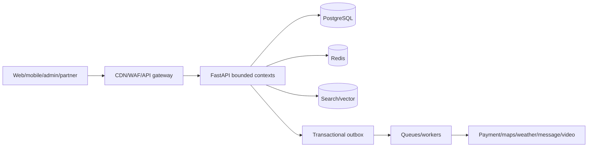

# NAMO SETU

NAMO SETU is an AI-powered pilgrimage ecosystem for verified temple discovery, personalized yatra planning, travel/service booking, donations, live darshan, family coordination and emergency assistance. It connects devotees with temple trusts and verified local partners while keeping identity, money, inventory and safety decisions in deterministic, auditable workflows.

> Project status: production-oriented reference implementation and documentation suite. Provider integrations, regulatory approvals and emergency-service agreements must be completed and verified per launch geography before real-world production use.

## Product capabilities

- Multilingual temple and destination discovery
- Evidence-grounded AI yatra planner with editable itineraries
- Hotel, dharamshala, cab, guide, pandit and puja journeys
- Hosted payment, wallet, donation, refund, invoice and signed QR designs
- Live darshan, festivals, family mode, rewards, reviews and wishlist
- Consent-driven SOS with immediate human-call fallback
- Temple, partner, admin, ERP, CRM, analytics and support workflows
- Responsive, accessible, offline-aware PWA experience

## Architecture



The initial backend is a modular monolith split into identity, catalogue, commerce, experience, engagement, intelligence and operations. PostgreSQL is the transactional authority. Redis, search, vectors and analytics are projections. Workers isolate notifications, indexing, media, reports and AI. Services are extracted only when ownership, scale or fault-isolation evidence justifies the operational cost.

## Technology

| Layer | Current/reference technology |
|---|---|
| Web | TypeScript, Vite, responsive PWA assets |
| Backend | Python, FastAPI, SQLAlchemy-ready domain structure |
| Data | PostgreSQL, Redis, search and vector-store design |
| Async | Transactional outbox, RabbitMQ/streams and idempotent workers |
| AI | Orchestrated specialist agents, hybrid RAG and consented memory |
| Delivery | Docker, GitHub Actions, CodeQL/container scans and Vercel web deployment |

## Repository structure

```text
.
├── backend/                 FastAPI application, tests and deterministic seed
├── docs/                    Product, architecture, API, workflow and launch manuals
├── infra/                   Infrastructure and deployment assets
├── public/                  Static public assets
├── src/                     Typed web source
├── .github/workflows/       CI and security automation
├── docker-compose.yml       Local supporting stack
├── index.html               Web application shell
├── styles.css               Design implementation
└── script.js                Interactive product behavior
```

## Quick start

Prerequisites: Node.js 22+, npm, and Python 3.11+ for backend work.

```powershell
git clone https://github.com/Ankushkumar2811/namo-setu.git
cd namo-setu
npm ci
npm run typecheck
npm run dev
```

Backend:

```powershell
cd backend
python -m venv .venv
.\.venv\Scripts\Activate.ps1
pip install -e ".[test]"
uvicorn app.main:app --reload
```

For backing services:

```powershell
docker compose up --build
```

## Configuration

Use [environment variable documentation](docs/ENVIRONMENT_VARIABLES.md) as the configuration inventory. Store actual values in ignored local files or an approved secret manager.

Core groups include:

- Application URL, environment and log level
- PostgreSQL, Redis, queue, search/vector and object storage
- JWT/session encryption and workload credentials
- Payment, maps, weather, messaging and video providers
- AI model/embedding gateway and evaluation controls
- Telemetry, error monitoring and alert routing

Never expose server secrets through Vite/public variables or commit credentials.

## Commands

| Command | Description |
|---|---|
| `npm run dev` | Start the web development server |
| `npm run typecheck` | Validate TypeScript |
| `npm run build` | Create the production web build |
| `npm run preview` | Preview the built web app |
| `pytest` from `backend` | Run backend tests |
| `python -m compileall -q app scripts` | Compile-check backend code |

## Testing and quality

The CI pipeline runs frontend type/build checks, dependency audit, backend lint/compile/tests, API artifact validation, container build/vulnerability policy and CodeQL. Critical commerce changes also require idempotency, concurrency, duplicate/out-of-order webhook, authorization and ledger tests. AI changes require grounding, citation, safety, injection, multilingual and fallback evaluations.

## Deployment

The web app is deployed at [namo-setu.vercel.app](https://namo-setu.vercel.app). See the [installation and deployment guide](docs/PART_10_INSTALLATION_DEPLOYMENT.md) for local, Docker, Vercel, Railway, Render, AWS, Azure and GCP patterns.

Production promotion uses an immutable artifact, compatible database migration, canary, SLO/business guardrails and rollback. Complete the [launch checklist](docs/PART_10_LAUNCH_COMPLIANCE_RISK.md) before processing real users or money.

## Documentation

### Product and presentation

- [Executive summary, story and demo scripts](docs/PART_10_EXECUTIVE_AND_PRESENTATION.md)
- [Roadmap, investor narrative and business model](docs/PART_10_ROADMAP_INVESTOR.md)
- [112-question technical interview guide](docs/PART_10_INTERVIEW_GUIDE.md)

### Engineering

- [System specification](docs/SYSTEM_SPECIFICATION.md)
- [Backend architecture](docs/BACKEND_ARCHITECTURE.md)
- [Database specification](docs/DATABASE_SPECIFICATION.md)
- [API reference](docs/API_REFERENCE.md) and [OpenAPI](docs/openapi.yaml)
- [AI architecture](docs/AI_ARCHITECTURE.md)
- [Events and integrations](docs/EVENTS_AND_INTEGRATIONS.md)
- [Production operations](docs/PRODUCTION_OPERATIONS.md)

### Workflows and handover

- [Complete workflow manual](docs/PART_9_WORKFLOW_MANUAL.md)
- [System flows and diagrams](docs/PART_9_SYSTEM_FLOWS.md)
- [AI workflow manual](docs/PART_9_AI_WORKFLOW_MANUAL.md)
- [Operations and support manual](docs/PART_9_OPERATIONS_AND_SUPPORT.md)
- [Developer handover](docs/PART_9_DEVELOPER_HANDOVER.md)
- [Launch, compliance, risk and maintenance](docs/PART_10_LAUNCH_COMPLIANCE_RISK.md)

## Contributing

1. Create a focused branch and link the business journey/acceptance criteria.
2. Preserve domain boundaries and avoid direct state/ledger mutation.
3. Add tests for success, error, authorization, concurrency and retry paths.
4. Update OpenAPI, events, migrations, workflow and runbooks when affected.
5. Run typecheck, build and backend tests before opening a review.
6. Do not commit secrets, personal data, provider production payloads or generated build output.

Changes touching money, identity, privacy, emergency, tenant isolation or AI actions require the relevant domain/security review.

## Security and responsible disclosure

Do not open a public issue containing a vulnerability, credential or personal data. Contact the repository owner privately and include affected component, impact, safe reproduction and suggested mitigation. Do not test against real users, providers or production data without written authorization.

## License

No open-source license is currently granted. The source and documentation remain under their respective copyright holder’s rights unless a repository license is added.
