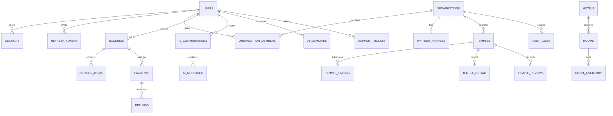

# NAMO SETU database specification

## 1. Data ownership and conventions

PostgreSQL is the transactional system of record. Every mutable business table uses UUID identity, `created_at`, `updated_at`, nullable `deleted_at`, named constraints and explicit indexes. Deletion is soft by default; payment ledger, audit and legal-receipt records are immutable and never soft-deleted. UTC is stored in the database and converted only at presentation boundaries. Monetary amounts use `numeric(14,2)` plus ISO-4217 currency.

Tenant-owned records carry `organization_id`. Row-level security policies validate membership and region scope. Application checks remain mandatory because RLS is defense in depth, not the primary authorization layer.

## 2. Entity relationship overview

## 3. Database dictionary

| Domain | Tables | Primary relationships and constraints |
|---|---|---|
| Identity | `users`, `roles`, `permissions`, `role_permissions`, `sessions`, `refresh_tokens`, `otp_challenges`, `devices` | Unique normalized email/phone; session and OTP expiry indexes; revoked refresh token digests retained for reuse detection |
| Tenancy | `organizations`, `organization_members`, `partner_profiles`, `feature_flags` | Unique organization slug; unique `(organization_id,user_id)`; commission 0–100; organization-scoped feature rollout |
| Geography | `countries`, `states`, `cities`, `geo_places`, `routes` | ISO country/state codes; PostGIS geography indexes; route origin must differ from destination |
| Temples | `temples`, `temple_images`, `temple_videos`, `temple_history`, `temple_timeline`, `temple_timings`, `temple_facilities`, `temple_crowd`, `temple_reviews`, `temple_faqs`, `temple_streams` | Unique slug; rating 0–5; crowd observation unique by temple/source/time; verified content requires reviewer |
| Festivals | `festivals`, `temple_festivals`, `festival_events`, `festival_alerts` | Date range valid; unique festival/temple/year; operational notices have validity windows |
| Stays | `hotels`, `rooms`, `room_inventory`, `room_prices`, `amenities`, `hotel_amenities`, `hotel_images`, `hotel_reviews`, `dharamshalas`, `beds` | Inventory unique `(room_id,date)`; price non-negative; booked ≤ available; tax and cancellation policy versioned |
| Mobility | `transport_services`, `cab_operators`, `bus_services`, `train_services`, `flight_services`, `parking`, `fuel_stations`, `ev_chargers` | Provider service IDs unique; departure before arrival; geographic indexes on stops and facilities |
| Local care | `guides`, `pandits`, `restaurants`, `food_services`, `medical_facilities`, `emergency_contacts` | Verification required before availability; languages in join table; emergency contacts have authority and validity |
| Commerce | `bookings`, `booking_items`, `coupons`, `coupon_redemptions`, `payments`, `refunds`, `invoices`, `wallet_accounts`, `wallet_entries` | Unique booking reference/idempotency key; append-only double-entry wallet; captured payments cannot exceed booking balance |
| Giving and rituals | `donation_campaigns`, `donations`, `donation_receipts`, `puja_types`, `puja_slots`, `puja_bookings`, `prasad_shipments` | Receipt numbers unique; campaign totals derived; slot capacity enforced atomically |
| Engagement | `notifications`, `notification_deliveries`, `push_devices`, `rewards`, `reward_entries`, `achievements`, `referrals` | Delivery idempotency; reward ledger append-only; referral self-reference prohibited |
| Content | `articles`, `blogs`, `news`, `pages`, `media`, `galleries`, `faqs`, `seo_metadata` | Unique locale/slug; published content requires version and approver; media checksum deduplication |
| Support/CRM | `support_tickets`, `ticket_messages`, `crm_leads`, `crm_interactions`, `tasks`, `campaign_memberships` | SLA deadlines indexed; channel messages immutable; consent controls marketing assignment |
| AI | `ai_conversations`, `ai_messages`, `ai_memories`, `ai_preferences`, `ai_feedback`, `ai_cost_logs`, `knowledge_documents`, `knowledge_chunks` | Memory requires consent source and expiry; model usage indexed by provider/day/tenant; citations stored with each answer |
| Operations | `audit_logs`, `activity_logs`, `system_logs`, `outbox_events`, `webhook_receipts`, `analytics_events`, `report_jobs` | Audit/outbox append-only; webhook provider/event unique; analytics events partitioned by event date |

## 4. Index strategy

- B-tree: foreign keys, status, timestamps, booking reference, normalized identifiers.
- Composite: `(organization_id,status,created_at)`, `(user_id,created_at)`, `(temple_id,observed_at desc)`.
- Partial: active records where `deleted_at IS NULL`; pending bookings; open SLA tickets.
- GIN: PostgreSQL full-text vectors and JSONB policy metadata.
- GiST: PostGIS locations and route corridors.
- BRIN: append-only analytics, audit and system logs ordered by time.

All production indexes are created concurrently after backfill. Query plans are captured before and after index changes.

## 5. Partitioning and lifecycle

`analytics_events`, `audit_logs`, `system_logs`, `ai_cost_logs`, `notification_deliveries` and `temple_crowd` use monthly range partitions. Current plus three previous partitions remain on primary storage; older partitions move to compressed archival storage. Booking/payment records remain online for statutory and reconciliation periods. User deletion pseudonymizes identity while preserving legally required financial records.

## 6. Consistency

Inventory reservation uses `SELECT … FOR UPDATE SKIP LOCKED` with a short expiry. Payment webhooks lock the payment row and use provider event IDs for idempotency. Wallet and settlement operations use serializable transactions. Search, vector and analytics stores are projections updated through the transactional outbox and may be eventually consistent.

## 7. Backup and audit

PITR continuously ships WAL to a second region. Daily snapshots retain 35 days; monthly encrypted archives retain according to finance policy. Restore tests are quarterly. Audit records contain actor, tenant, role, action, target, before/after hashes, request ID, IP, device and reason, and are protected by write-once storage export.
