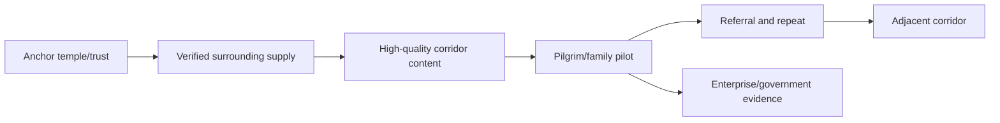

# NAMO SETU — Roadmap, business model and investor narrative

## Outcome-based roadmap

Roadmap dates are approved only after discovery and capacity planning. Each stage advances on evidence gates.

| Version | Scope | Exit evidence |
|---|---|---|
| V1 — MVP | Identity/consent, verified temples, search/detail, basic planner, saved journeys, support/admin foundation | Pilot catalogue freshness, accessible task completion, stable SLOs |
| V2 — Commerce | Hotels/dharamshalas, guides/pandits/puja/cabs, coupons, payment, refund, QR, invoice | Booking success and reconciliation targets; partner fulfillment SLA |
| V3 — Responsible AI | Multi-agent planner, hybrid RAG, private memory, evaluation, PDF/calendar, crowd/weather | Grounding/citation/safety and user-satisfaction gates |
| V4 — Enterprise | Multi-tenant ERP/CRM, partner settlement, analytics, SSO, audit/export and regional operations | Tenant isolation, enterprise SLO, audit and unit economics |
| V5 — Government integration | Standards-based tourism/temple/emergency/capacity interfaces under agreements | Privacy impact assessment, interoperability/security certification, live pilot |
| V6 — International | Multi-currency/language/jurisdiction, global sacred destinations and partner network | Country compliance, localized supply quality and positive cohort economics |

## Future capability portfolio

| Capability | User value | Prerequisite and guardrail |
|---|---|---|
| Blockchain donation ledger | Independently verifiable allocation trail | Governance and cost proof; never expose donor identity or replace accounting |
| Digital temple passport | Consented visit history and rewards | Portable credential, revocation and user-controlled sharing |
| AR temple guide | Contextual navigation/storytelling | Verified content, accessibility and on-device privacy |
| VR darshan | Remote immersive access | Temple rights, bandwidth ladder and comfort controls |
| Drone live streaming | Festival coverage | Aviation permissions, safety, geofencing and privacy |
| Digital twins | Operations, capacity and conservation simulation | Accurate sensors/models and restricted security detail |
| Wearable/smartwatch | Reminders, navigation and SOS | Explicit health/location consent and low-power offline mode |
| IoT crowd sensors | Safer capacity planning | Aggregation, device security, retention and no covert tracking |
| AI vision queues | Queue estimates | Edge redaction, accuracy/bias validation and signage |
| Face recognition | Narrow lawful safety/access use only | Explicit legal basis, necessity/proportionality, independent review and opt-out; default disabled |
| Offline AI | Language/help without connectivity | Small approved model, signed updates and bounded knowledge |
| Satellite navigation | Resilience in remote routes | Supported devices/provider contracts and emergency caveats |

## Investor deck content

1. **Problem:** pilgrimage planning and fulfillment are fragmented, opaque and trust-sensitive.
2. **Solution:** one verified network for discovery, planning, commerce, devotion, family safety and partner operations.
3. **Beachhead:** dense pilgrimage corridors where a small verified supply network creates repeated itinerary value.
4. **Market:** validate bottom-up—active pilgrims in pilot corridors × eligible journeys × achievable transaction/service value. Commission an independent study before external claims.
5. **Business model:** diversified transaction, SaaS and enterprise revenue with clear user consent and partner value.
6. **Moat:** verified supply graph, fulfillment history, workflow integration, trust/audit layer and responsibly learned preferences—not an LLM wrapper.
7. **Technology:** modular transaction platform, realtime projections, signed QR, multi-agent RAG and production governance.
8. **Go-to-market:** temple-anchor partnerships → surrounding stays/services → family/referral demand → corridor replication → enterprise/government.
9. **Milestones:** verified supply, planning activation, first successful bookings, repeat cohorts, partner SLA, reconciled GMV and scalable acquisition.
10. **Funding use:** product/engineering, partner onboarding/operations, trust/safety/compliance, demand experiments and working capital reserve.
11. **Ask:** size funding from an 18–24 month milestone plan after audited vendor, payroll and pilot budgets; do not invent a headline number.
12. **Return thesis:** a trusted pilgrimage network can expand from planning into commerce, partner software and governed regional infrastructure.

## Business model

| Stream | Charging unit | Value and guardrail |
|---|---|---|
| Hotel/dharamshala commission | Completed booking | Incremental demand; transparent total price/refund |
| Travel/cab/guide/pandit/puja commission | Fulfilled service | Verified lead, payment and support; no pay-to-hide quality |
| Temple subscription | Monthly/annual tier | CMS, darshan, operations and analytics; donation access not held hostage |
| Partner subscription | Location/user/module tier | Inventory, CRM, settlement and reporting |
| Premium AI | Individual/family subscription | Advanced planning/export/alerts; core safety remains accessible |
| Advertising | Labelled impression/action | Relevance, frequency caps, no sensitive targeting |
| Donation processing | Disclosed processing/service fee where lawful | Clear before payment; trust/governance approval |
| Analytics | Aggregated report/API | Minimum cohorts, contract and no re-identification |
| Enterprise licensing | Subscription/implementation/SLA | SSO, governance, integrations and support |

Track contribution margin by stream: recognized revenue minus gateway/refund, provider/model, support, incentives and variable infrastructure. Pilot forecasts use low/base/high assumptions for verified supply, conversion, average order, take rate, cancellation, repeat and acquisition; each assumption has an owner and evidence date.

## Go-to-market and marketing

- SEO: structured, multilingual, authoritative temple/festival/accessibility pages; no doorway pages.
- Content: seasonal planning, ritual etiquette, safety and accessible travel reviewed by domain owners.
- Social/influencer: trackable corridor stories with paid disclosure and no unverifiable claims.
- Temple/travel partnerships: shared SLA, onboarding, settlement and co-marketing playbook.
- Referral: reward fulfilled journeys, prevent self-referral/fraud and display conditions.
- Affiliate: approved inventory, attribution window and brand/compliance terms.

## Competitive frame

| Alternative | Strength | Gap NAMO SETU targets |
|---|---|---|
| General OTAs | Inventory and payment scale | Sacred context, temple operations, integrated rituals/family safety |
| Temple-specific apps/sites | Authority and devotion | Fragmented trip inventory and cross-destination planning |
| Tour operators | Human service and packages | Transparency, self-service, portability and realtime insight |
| Search/social/messaging | Discovery and reach | Verification, transaction accountability and continuity |

The USP is the combined verified spiritual graph, executable family-aware planning, deterministic commerce and trust governance.

