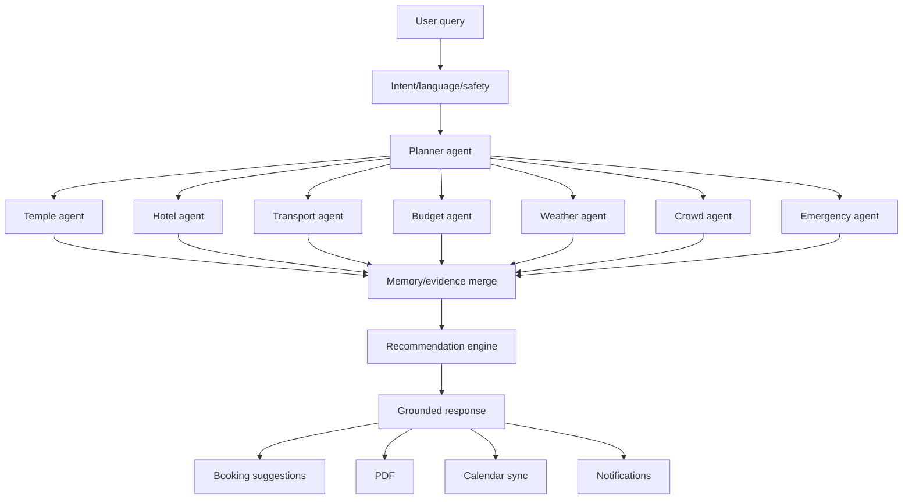
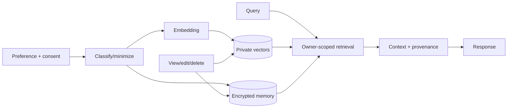
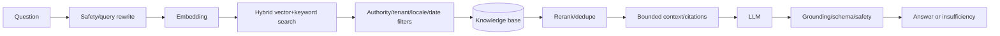

# NAMO SETU — AI workflow manual

The orchestrator owns the final answer and authorization. Specialists return typed facts, constraints, confidence and provenance. Booking output is a suggestion or draft; explicit user confirmation starts deterministic Commerce.

| Step | Processing | Output/guardrail |
|---|---|---|
| Intent | Classify plan/search/support/emergency and missing slots | Typed intent; emergency exposes human help immediately |
| Planner | Decompose dates, people, origin, budget and accessibility | Execution graph/clarifications |
| Temple | Verified catalogue, festivals and timing | Ranked candidates with source/version |
| Hotel | Availability snapshot and policy | Options, never a lock claim |
| Transport | Maps/transit/cab tools | Legs, time and fallback |
| Budget | Deterministic cost ranges/totals | Transparent estimate/contingency |
| Weather | Geo/date provider and seasonal evidence | Timestamp and confidence |
| Crowd | Observation and historical projection | Confidence-labelled advice |
| Emergency | Verified facilities/precautions | No diagnosis or autonomous dispatch |
| Memory | Owner/purpose/consent-filtered retrieval | Minimum relevant private context |
| Recommendation | Feasibility, diversity and preference score | Explainable primary/alternatives |
| Response | Citation/conflict/schema/safety validation | Grounded stream or honest insufficiency |
| Export/action | User-approved plan | Audited PDF/ICS/draft intents |

## Memory

Memory records owner, purpose, consent/source, confidence, timestamps, expiry and embedding version. Sensitive traits are not inferred. Users can inspect, correct and delete memory.

## RAG

Ingestion malware-scans, verifies authority, chunks semantically and records checksum/effective/version metadata. Retrieved content is untrusted data, never instruction.

Tool timeouts yield labelled partial plans. Agent disagreement is surfaced or clarified. Invalid structure gets one bounded repair. Model outage preserves deterministic search/booking and saved plans. Prompt injection and exfiltration are constrained through isolated tool permissions and ownership filters. Prompt/model/retrieval/embedding releases pass citation, constraint, injection, multilingual, safety, latency and cost evaluations, then canary with rollback.
