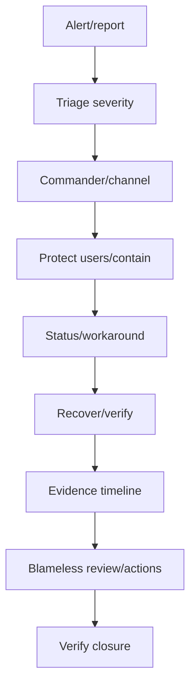
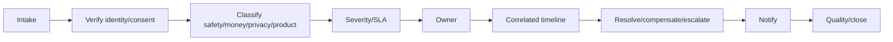

# NAMO SETU — Operations, admin and support manual

## Operating model

| Cadence | Product/operations | Engineering/SRE | Trust/finance |
|---|---|---|---|
| Continuous | Booking/payment/SOS, queue/provider health | SLO/error/saturation/security | Fraud, unsafe content, money variance |
| Daily | Fulfillment, tickets, catalogue freshness | Failed jobs, backup, cost | Payment/donation/wallet reconciliation |
| Weekly | Conversion/cancellation/partner SLA | Capacity/error budget/dependencies | Approval/dispute/AI evaluation |
| Monthly | Business/roadmap review | Restore/access/patch review | Settlement/compliance/retention |
| Quarterly | Disaster/emergency exercise | Restore/failover simulation | Privileged access/policy review |

## Incident and support flows

SEV-1 covers broad identity/booking failure, financial inconsistency, emergency failure or sensitive-data exposure. Ledgers are never repaired by direct edit; reversible flags, traffic controls and compensating commands are preferred.

Support sees minimum data; payment, bank, identity and health data are masked. High-impact refunds/account changes/exports require step-up verification and thresholds.

## Runbooks

- **Captured payment, pending booking:** locate provider/correlation references; verify signature and dedupe; compare payment/ledger/booking/inventory; run idempotent reconciliation; reaccommodate/refund if needed; notify and verify balanced compensation.
- **Oversell:** stop-sell, identify holds/bookings, apply confirmed-priority policy, offer alternatives, reconcile projections, fix concurrency/sync and verify before reopening.
- **Notification outage:** pause nonessential retries, use consented fallback for essential/emergency messages, show in-app status and drain gradually with dedupe.
- **AI regression:** disable affected version/tool, route to approved deterministic/previous version, retain redacted trace IDs, evaluate and canary the fix.
- **Emergency provider outage:** show cached verified call/SMS actions, continue visible local location and alert operations; never substitute AI for responders.
- **Privacy request:** verify identity, discover processors/data, apply lawful retention exceptions, export/correct/delete primary and derived data, rebuild indexes and retain evidence.

## Release, recovery and audit

Reviewed change → CI/API/security checks → immutable artifact/SBOM → staging migration/smoke → canary → SLO/business guardrails → gradual production → verification. Schemas use expand/migrate/contract. Application rollback is allowed; data uses a tested forward-fix or compensation.

Multi-AZ database, point-in-time/offsite encrypted backups, retained webhook/event replay, cached read-only discovery/emergency guidance and audited manual fulfillment provide continuity. Privileged commands record actor, tenant, role, purpose, correlation, target, transition, reason and result. Audit exports are restricted, checksummed, time-bounded and watermarked.
