# NAMO SETU — System flows and diagrams

## Architecture

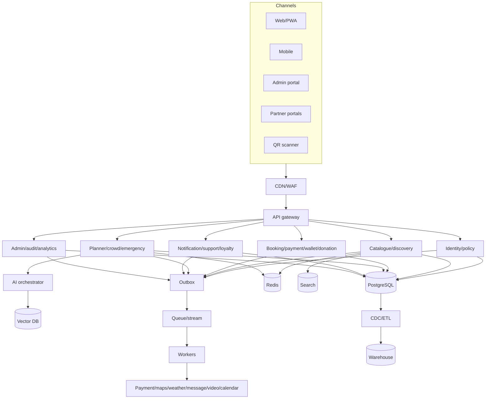

The initial system is a modular monolith with strict bounded contexts and independently scalable workers. A boundary becomes a microservice only when ownership, scale or fault isolation warrants it.

## Data-flow diagrams

### Level 0

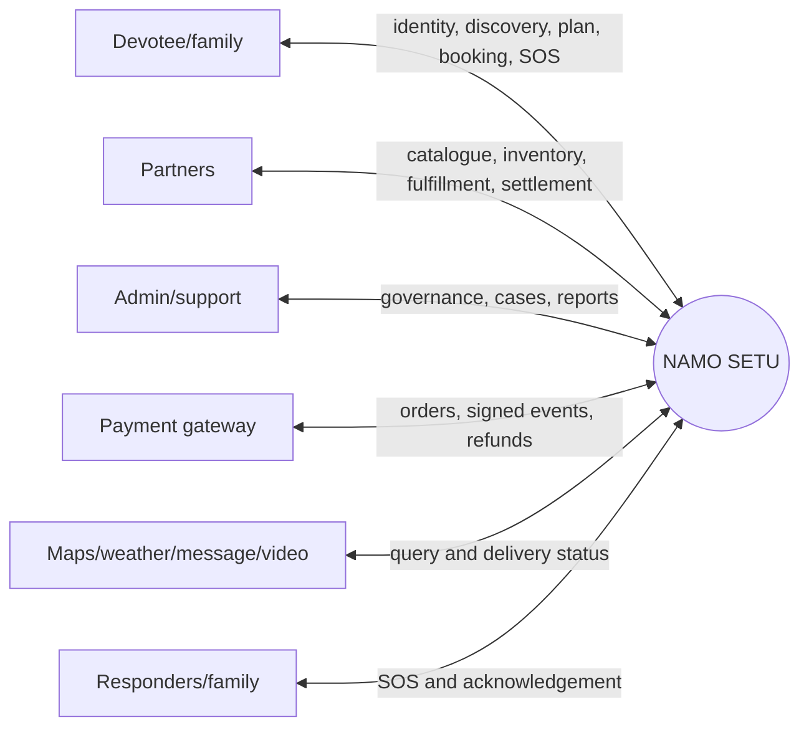

### Level 1

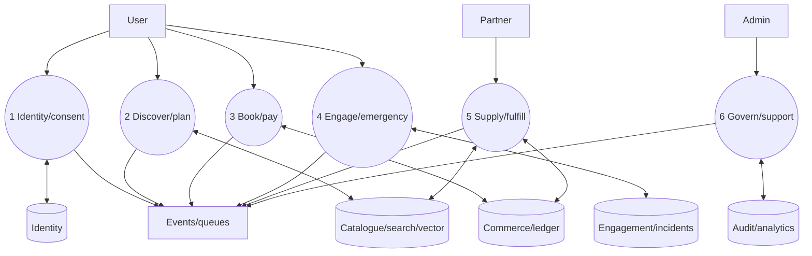

### Level 2 — booking

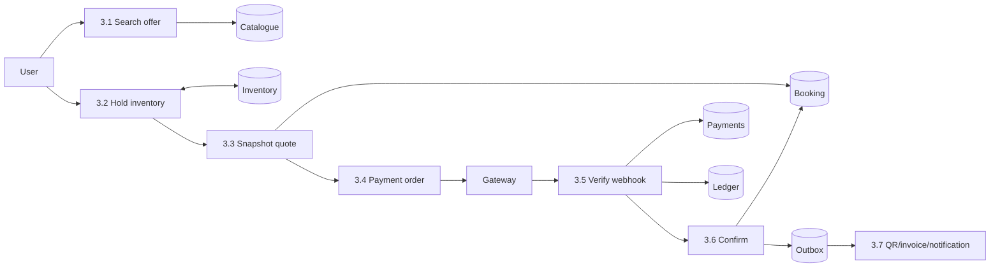

## Low-level component design

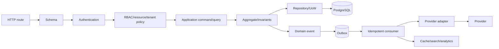

Routes handle transport; application services coordinate; aggregates enforce transitions. Adapters have deadlines, bounded retries and circuit breakers. Logs/traces carry request, correlation, actor and tenant identifiers.

## Deployment, network and security

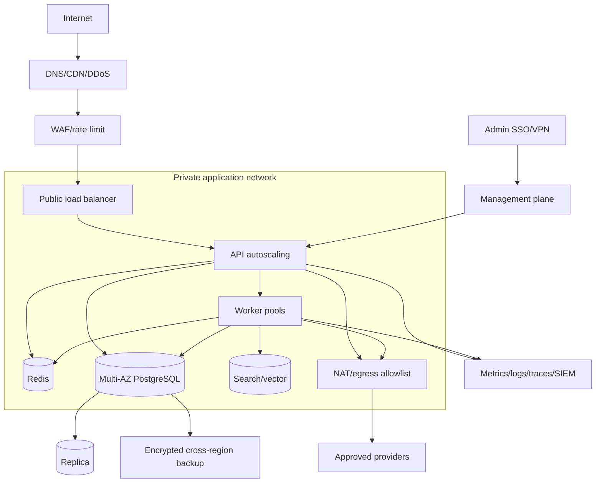

Only CDN/WAF and the load balancer accept public ingress. Datastores are private. Workloads use identities instead of static cloud keys. Production and non-production have separate accounts, networks, secrets and data.

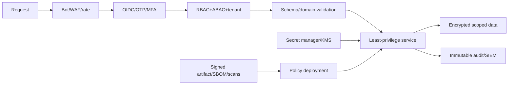

## Sequence diagrams

### Login

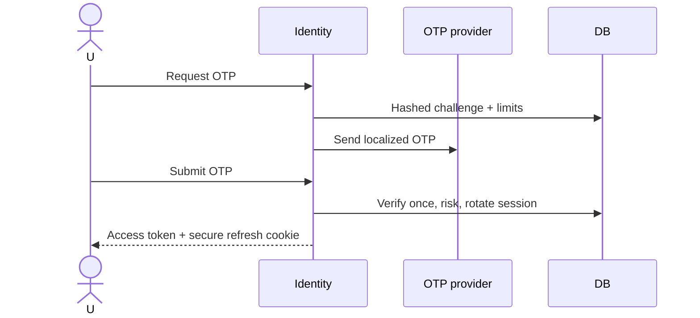

### Booking/payment

```mermaid
sequenceDiagram
  actor U
  participant B as Booking API
  participant DB
  participant G as Gateway
  participant W as Webhook
  participant Q as Worker
  U->>B: Confirm quote + idempotency key
  B->>DB: Lock inventory; create hold/booking/order
  B-->>U: Hosted checkout
  U->>G: Pay
  G->>W: Signed capture
  W->>DB: Dedupe + confirm + ledger + outbox
  DB-->>Q: booking.confirmed
  Q-->>U: QR, invoice, notification
```

### Donation

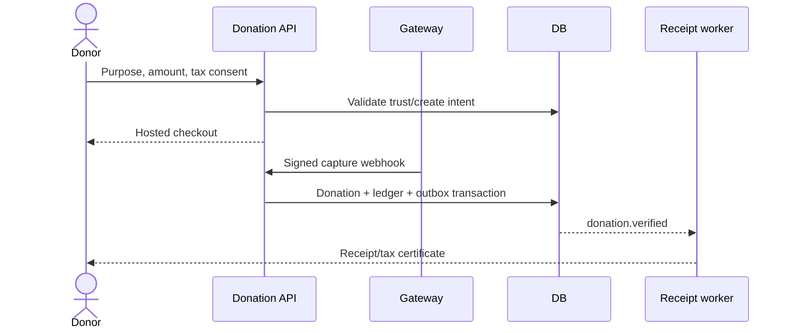

### AI planner/chat

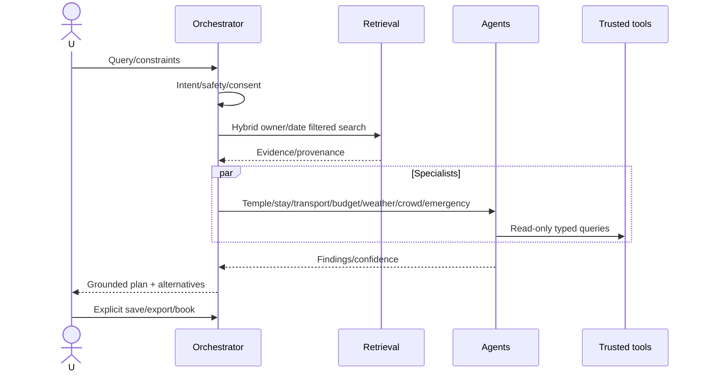

### Notification

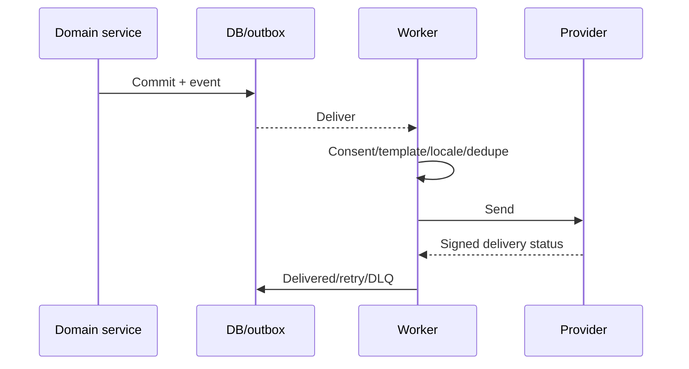

### Emergency

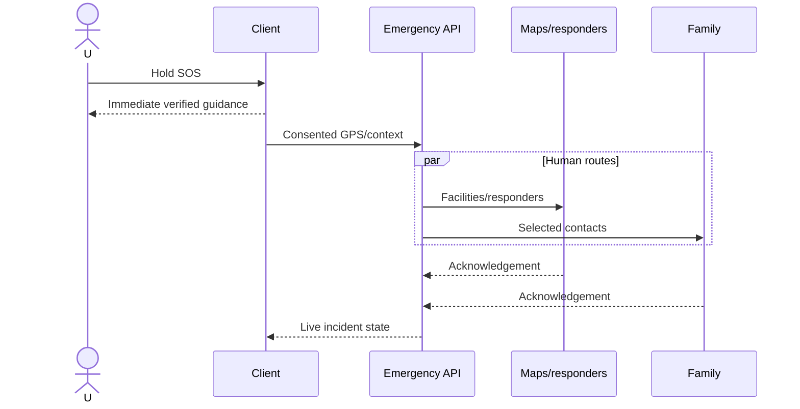

### QR pass

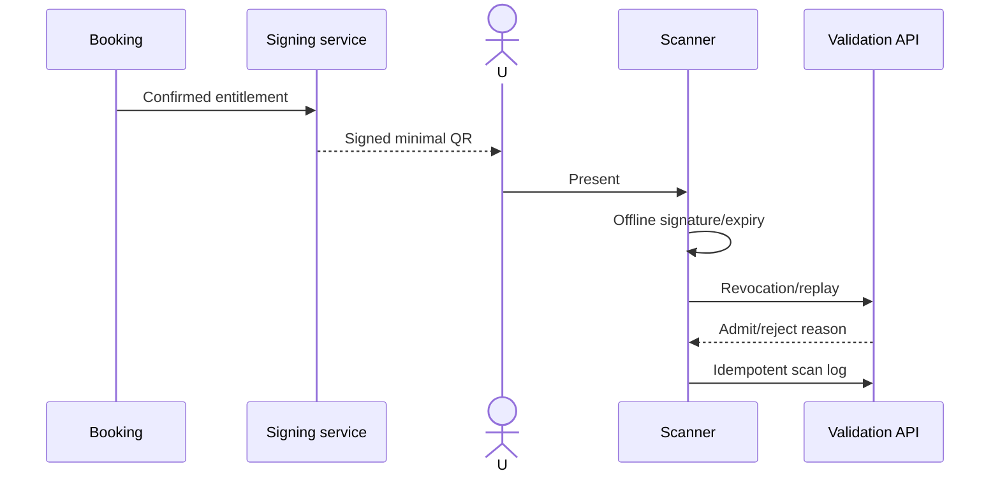

### Refund

```mermaid
sequenceDiagram
  actor U as User/admin
  participant C as Commerce
  participant DB
  participant G as Gateway
  participant Q as Reconciliation
  U->>C: Refund request
  C->>DB: Policy/ownership; pending refund
  C->>G: Idempotent refund
  G->>C: Signed refund status
  C->>DB: Compensating ledger + state + outbox
  Q->>G: Reconcile mismatch/timeout
  C-->>U: Status/credit note
```

## Activity diagrams

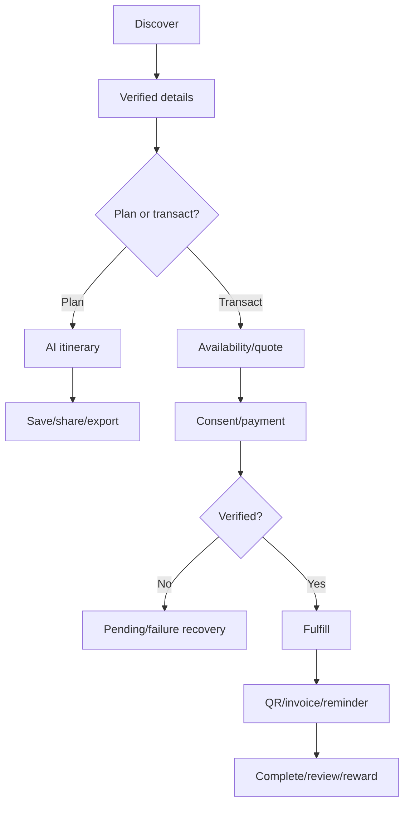

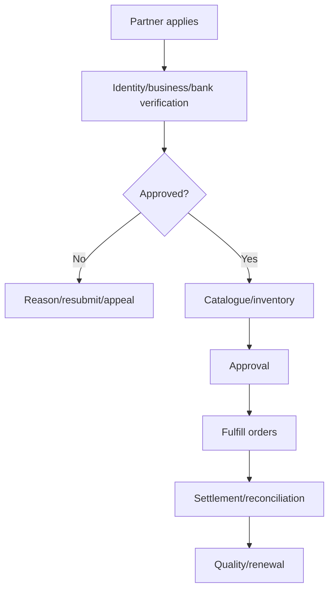

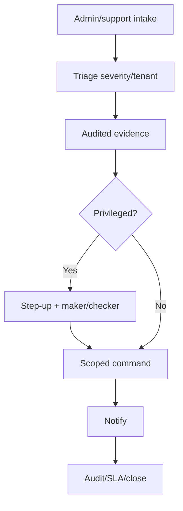

Critical paths use time budgets and degrade optional enrichment. Writes use row locks or optimistic versions. Consumers dedupe and acknowledge after durable effect. Money reconciliation compares gateway, payment and ledger. Commerce RPO is at most five minutes and critical RTO at most thirty minutes, verified by restore exercises.
