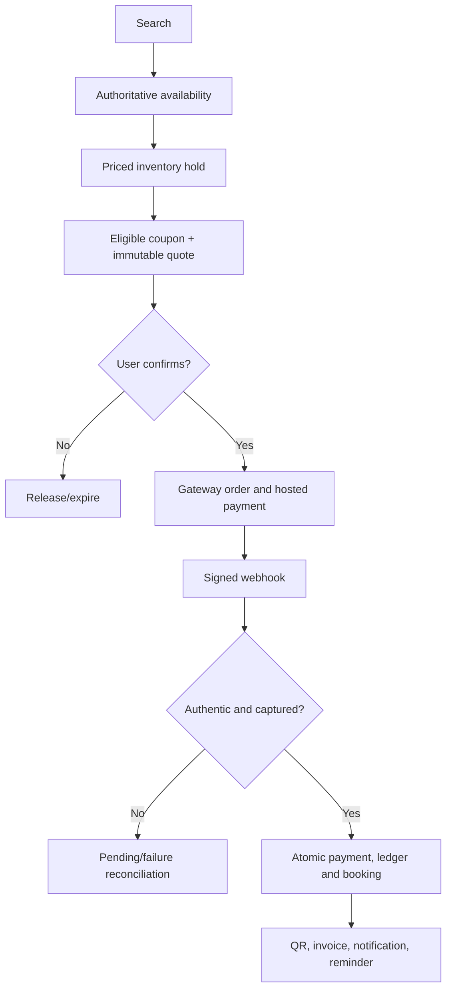
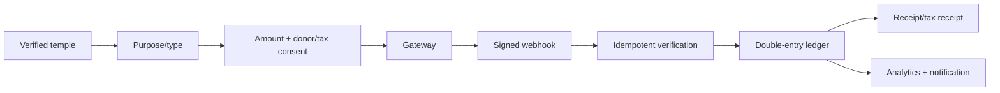
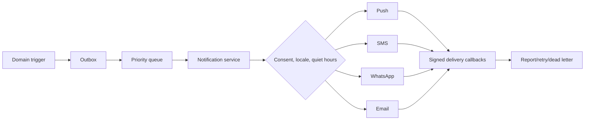
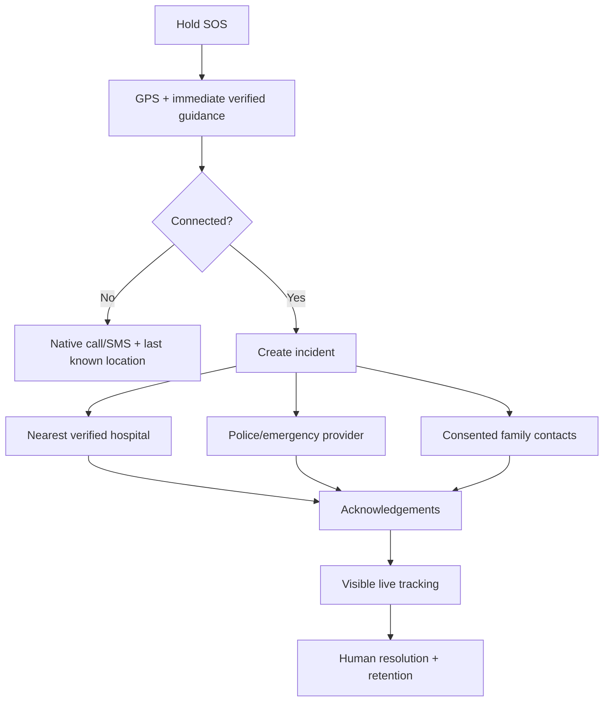
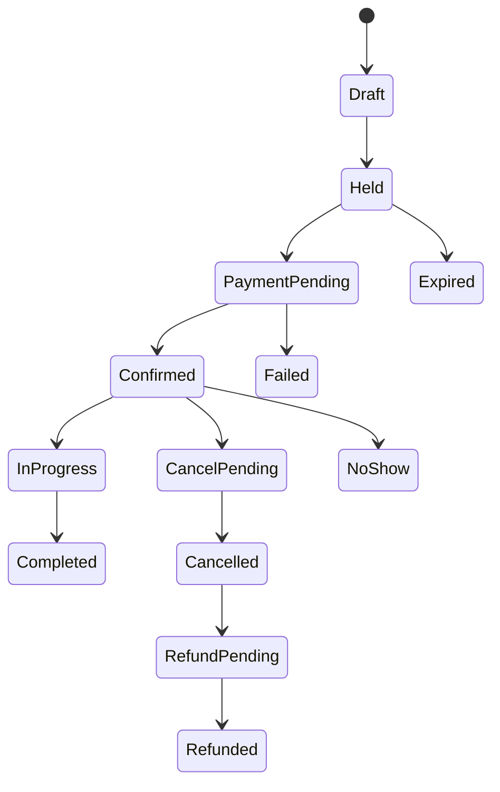

# NAMO SETU — Complete workflow and business architecture

Version 1.0 | Owner: Product & Enterprise Architecture

## Workflow contract

Every workflow is specified through: purpose, actors, preconditions, user journey, system journey, backend processing, database operations, AI actions, integrations, notifications, errors, success, alternatives, edge cases, security and performance.

All mutations carry request and idempotency IDs. PostgreSQL is authoritative; Redis/search/vector stores are projections. A transactional outbox publishes committed events. AI advises and prepares drafts but never confirms money movement, bookings or emergency resolution.

## User journey catalogue

| Journey | Purpose, actors and preconditions | User and system flow | Data, AI, integrations and notification | Errors, alternatives, security and performance | Success |
|---|---|---|---|---|---|
| New user registration | Consented identity; guest, Identity, OTP; reachable channel | Enter identifier/terms → OTP → optional profile; normalize, rate-limit, verify, issue session | Insert user, identity, consent, session; SMS/email OTP | Duplicate links account; expired OTP retries; hashed OTP, anti-enumeration; provider excluded from p95 | Active user with consent evidence |
| Login | Resume securely; user, Identity, risk | Identifier → OTP/credential → risk → role-aware home | Rotate session/refresh family; OTP/device provider | Generic failures, lockout/recovery; short JWT, HttpOnly refresh, privileged MFA | Authenticated session |
| Guest | Low-friction discovery; visitor, catalogue | Browse/search/share with anonymous locale session | Ephemeral personalization only | Transaction redirects to sign-in; no private memory; edge cache | Useful discovery |
| Profile setup | Accessible personalization; user, Profile | Language/city/mobility/family/diet → save or skip | Profile and consent versions; optional private AI memory | Sensitive fields optional/encrypted; optimistic conflict handling | Versioned profile |
| Temple search | Relevant places; user, Search | Query/filter/map → ranked list | Search/geo projection, analytics; semantic rerank/maps | Typos and zero results get alternatives; verified data; p95 <500ms | Explainable results |
| Temple discovery | Inspiration; guest/user, recommender | Nearby/trending/festival cards → refine | Cached catalogue; consented recommender | Cold start uses editorial list; no sensitive inference | Relevant discovery feed |
| Temple details | Trusted decision data; user, trust | Timings/darshan/facilities/crowd/route | Catalogue, crowd, weather, maps; RAG cites source | Stale data labelled; signed media; edge-cached | Authoritative view |
| AI Yatra planning | Executable itinerary; user, orchestrator | Describe → clarify → generate → edit → save/share/book | Plan versions; specialist agents, RAG, maps/weather/crowd; PDF/calendar by consent | Conflict alternatives; injection defense/provenance; streamed response | Grounded itinerary |
| Hotel booking | Reserve room; user, hotel, Commerce | Search → room/guests → quote → pay → confirm | Inventory lock, booking/payment/ledger/outbox; hotel adapter | Price change reconfirmed, hold expiry; PCI redirect; atomic confirm | Booking, QR, invoice |
| Dharamshala booking | Policy-valid stay; user, manager | Search → eligibility/rules → occupants → reserve/pay | Property rules, capacity, booking | Explain mismatch; minimize identity data | Confirmed stay |
| Cab booking | Transport; user, cab partner | Pickup/drop → quote → choose/pay → assign | Trip/quote/location consent; maps/fleet | No driver, quote expiry, cancellation; masked contact; short TTL | Assigned/scheduled ride |
| Guide booking | Verified expert; user, guide | Language/date → slot → pay | Verification, availability lock, booking; matching AI | Transaction prevents overlap; scoped documents | Guide and meeting point |
| Pandit booking | Verified ritual expert; user, pandit | Puja/language/date → requirements → pay | Pandit/service/slot booking; checklist AI | Human clarification for mismatch; optional family data | Confirmed specialist |
| Puja booking | Ritual/remote offering; devotee, trust/pandit | Puja → sankalp/options → schedule/pay | Puja order, consent, fulfillment; payment/video | Missed slot uses policy; encrypt beneficiary details | Fulfillment order |
| Donation | Traceable contribution; donor, trust | Temple → purpose/type → amount/tax choice → pay | Donation/payment/ledger/receipt/outbox | Idempotent webhooks; verified beneficiary; immutable receipt | Verified donation/tax receipt |
| Wallet recharge | Add spendable balance; user, Wallet | Amount → pay → webhook → balance | Recharge, payment, double-entry ledger | Pending not spendable; compensating correction; limits/KYC | Credited balance |
| Payment | Settle payable intent; payer, gateway | Review → hosted checkout → status | Attempt, signed webhook, ledger, target aggregate | Redirect never confirms; duplicate/out-of-order safe; no card storage | Captured once |
| Booking confirmation | Consolidate evidence; user, provider | Confirmation → itinerary/contacts → manage | Generate invoice/QR; notification event | Downstream retries; ownership authorization | Durable package |
| QR pass | Fast entry; visitor, scanner | Download → scan → validate → admit/reject | Signed token and use log; offline public-key validation | Replay/expiry/revocation; minimum PII; scan <300ms | Audited admission |
| Live Darshan | Reliable stream; viewer, trust/CDN | Select quality/captions → watch | Entitlement/telemetry, video CDN | Offline shows schedule/recording; short signed URL, adaptive bitrate | Playback |
| Festival planning | Capacity-aware visit; family, planner | Festival/dates/group → plan | Festival/crowd/inventory; timed AI alternatives | Full capacity shifts date; official alert overrides AI | Saved plan |
| Family trip | Shared constraints; organizer/members | Invite → preferences → plan → approvals | Group/invite/consent/versions; AI constraint solver | Guardian for minors; member-scoped visibility | Agreed plan |
| Emergency SOS | Reach humans quickly; traveler/responders/family | Hold SOS → GPS → call/message → track → human close | Incident/location/delivery; maps/emergency; AI translation only | Offline native call/SMS; false-alarm cancel; explicit consent; immediate UI | Acknowledged incident |
| Reviews | Trusted feedback; user/partner | Rate/write/media → moderate → publish/appeal | Review/proof/moderation; AI spam/toxicity triage | Takedown/appeal; pseudonym, audit; async | Published/decision |
| Wishlist | Save private intent; user | Heart → collections → optional share | Wishlist/share token; consented recommendations | Unavailable item notice; owner-only; optimistic UI | Synced list |
| Rewards | Earn/redeem transparently; member/Loyalty | Balance/history → reward → redeem | Immutable reward ledger/redemption | Locked concurrent redeem; visible expiry | Confirmed reward |
| Logout | End access; user/Identity | Device/all sessions → revoke/local clear | Revoke token family and audit | Offline clears secrets and queues revoke; CSRF defense | Session unusable |

## Commerce, donation, identity and notification

The backend locks capacity, snapshots taxes/fees/policies, and never trusts browser return. It writes holds, bookings, items, attempts, ledger entries, passes, invoices and outbox events. AI can rank/explain but not price. Duplicate webhooks, expired holds, concurrent purchase, partial refunds and provider timeouts are explicit branches.

Only approved beneficiaries are selectable. Anonymous and tax-identified paths are clear. Corrections use refund/credit trails; analytics never becomes financial truth.

OTP is hashed/single-use; refresh reuse revokes its family. Admin and sensitive partner commands use MFA, reason and audit.

Emergency/essential overrides are governed; marketing never bypasses consent. Templates are escaped/versioned, attempts idempotent and fallbacks consent-aware.

## Emergency flow

AI never delays dispatch or closes an incident. Location is purpose-bound and stops at closure. Duplicate presses attach to the active incident.

## Admin journeys

| Journey | Primary flow and data work | Controls, errors, success |
|---|---|---|
| Login | Credential+MFA → risk → scoped console; session/audit write | No shared accounts, idle timeout; privileged session |
| Dashboard | Permission-filtered KPIs → drill-down; warehouse projections | Freshness label and tenant isolation |
| Temple/hotel approval | Queue → evidence → maker review → checker → publish | Rejection/resubmission, dual control, audit |
| Guide/partner verification | Identity, credential, KYB, bank, tax → review → activate | Restricted documents, expiry/mismatch/compliance escalation |
| Booking management | Timeline → permitted amend/cancel/refund | Policy preview, step-up, compensating transactions |
| Payment management | Provider/ledger compare → reconcile/refund | No ledger edits; approval thresholds |
| Donation reports | Trust/purpose/date → reconcile → export | Tenant scope, masked donor, watermark |
| Analytics | Governed metric/cohort → dashboard/export | Cell suppression, cached timestamped aggregates |
| User management | Lookup → consent/status → block/export/delete workflow | Reason code, least view, high-impact approval |
| AI monitoring | Redacted trace → evidence/safety/cost → rollback/version | No direct prompt edit; canary and evaluation |
| Content publishing | Draft → review/localize/schedule → publish/cache invalidation | Sanitization, maker-checker, version history |
| Notifications | Audience/template/consent preview → approve/enqueue | Quiet hours, opt-out, delivery reports |
| Support tickets | Intake → classify/SLA → investigate → resolve/survey | Identity check, redaction, full timeline |
| Audit logs | Actor/resource/time → view/export | Append-only, tamper-evident, governed retention |

## Partner journeys

Common lifecycle: application → identity/organization/bank verification → contract → catalogue and availability → approval → orders → fulfillment → settlement → quality/support → renewal or suspension.

| Partner | Specialized flow | Edge/security/performance |
|---|---|---|
| Temple trust | Temple/timing/festival/puja/donation/darshan → reports | Dual approval for beneficiary/content; closure invalidates caches |
| Hotel owner | Property/rooms/rates/calendar → stay fulfillment/settlement | Channel conflicts trigger stop-sell; idempotent sync |
| Dharamshala manager | Eligibility/rules/beds → check-in/reporting | Version rules before purchase; minimal guest data |
| Guide | Credential/language/area/rate/calendar → meet/complete | Expired credential stops sales; masked contact |
| Pandit | Tradition/language/puja/material/calendar → fulfill | Sensitive data scoped; substitution needs consent |
| Cab partner | Fleet/driver/docs/fares → dispatch/location/trip proof | Expiry blocks assignment; location retention |
| Travel agency | Packages/components/group manifests → settlement | Revalidate components; traveler consent/tenant isolation |
| Restaurant | License/menu/dietary/hours/capacity → orders | Evidence for allergen claims; quick availability propagation |

## State transitions

| Aggregate | Allowed lifecycle |
|---|---|
| Payment | `CREATED → AUTHORIZED → CAPTURED → PARTIALLY_REFUNDED/REFUNDED`; early `FAILED/EXPIRED` |
| Donation | `INITIATED → PAYMENT_PENDING → VERIFIED → RECEIPTED → SETTLED`; or `FAILED/REFUNDED` |
| Hotel | `DRAFT → UNDER_REVIEW → APPROVED → ACTIVE → SUSPENDED → ARCHIVED` |
| Guide | `APPLIED → DOCUMENT_REVIEW → VERIFIED → ACTIVE → SUSPENDED/EXPIRED → REVERIFIED` |
| Puja | `DRAFT → SCHEDULED → PAID → ASSIGNED → IN_PROGRESS → FULFILLED` plus policy cancellation |
| Notification | `CREATED → QUEUED → SENT → DELIVERED/READ`; retry to `DEAD_LETTER/FAILED` |

No generic state update exists. Commands validate actor, reason, current version, transition and invariants.

## Business transformation

| Manual process | Problem | NAMO SETU solution | Value | Future |
|---|---|---|---|---|
| Calls/fragmented sites | Unknown availability/inconsistent facts | Verified catalogue and inventory | Trust and conversion | Open partner APIs |
| Cash/spreadsheets | Weak traceability/reconciliation | Gateway verification, ledger, receipts | Auditable settlement/donations | Regulated disbursement |
| Generic itineraries | Miss faith, mobility, family/crowd needs | Evidence-grounded multi-agent planning | Safer personalization | Multimodal copilot |
| Paper passes | Queues/fraud/no capacity insight | Signed offline QR and scan audit | Faster entry | Privacy credentials |
| Phone-only emergency | Slow context/scattered contacts | Consented SOS/location/acknowledgement | Coordinated response | Government integration |
| Spreadsheet partners | Approval/SLA gaps | Tenant portals/workflow/audit | Scalable governance | Predictive operations |

Success measures cover search-to-plan and booking conversion, catalogue freshness, oversell, reconciliation variance, AI grounding/citation/safety, SOS acknowledgement, partner/support SLA, MFA and privacy request SLA. Every metric has an owner, definition, source, freshness and alert threshold.
