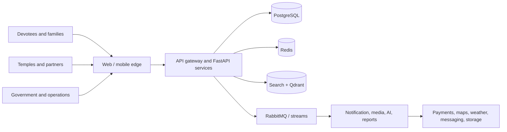
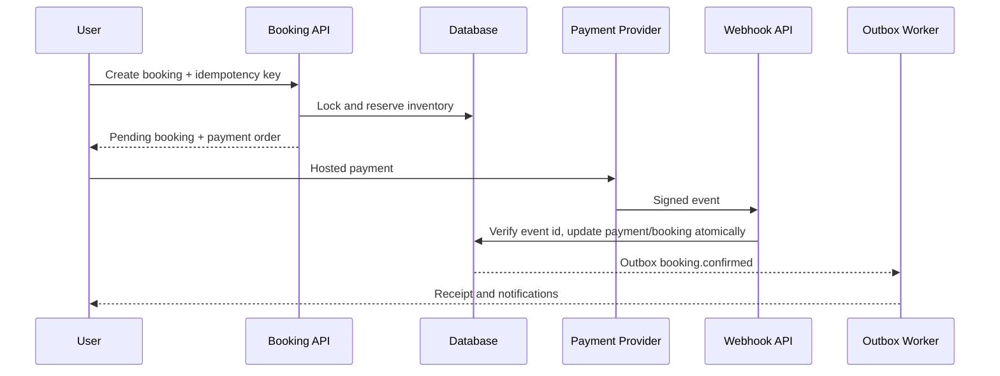
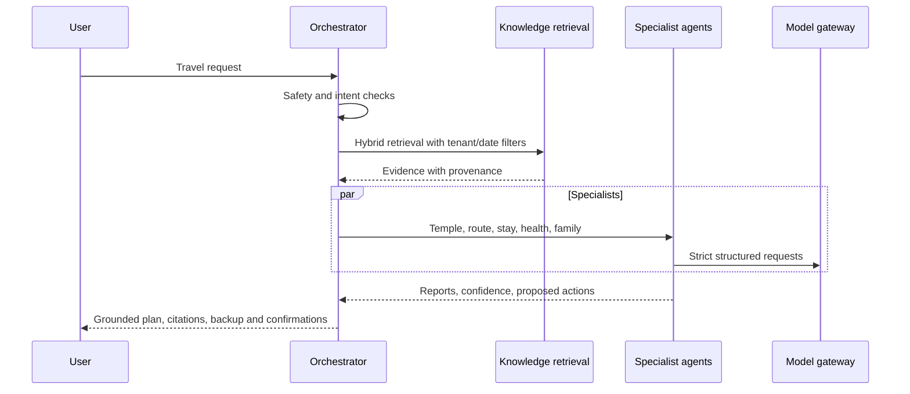

# NAMO SETU system specification

## Context

## Service boundaries

Identity controls credentials, sessions, consent and permissions. Catalogue controls temples, festivals, stays, guides and geographic services. Commerce controls booking, inventory, payments, refunds and ledgers. Experience controls crowd, weather, routes and realtime alerts. Engagement controls notifications, CMS, support, CRM and rewards. Intelligence controls RAG, agents, memory and evaluation. Operations controls tenant administration, audit, analytics and reports.

Services initially deploy as a modular monolith with strict internal boundaries and one transaction database. High-throughput projections, media, notifications and AI workers scale independently. A module may become a service only after its data ownership and operational profile require it.

## Critical sequences

### Booking and payment

### AI planner

### Emergency

The client immediately displays cached emergency guidance and verified national/local numbers. The API records a consented alert, notifies selected family members and routes to the emergency provider. AI may translate or summarize context but never delays, suppresses or autonomously closes the alert.

## Non-functional requirements

- Availability: 99.99% for identity, booking and emergency paths.
- Latency: p95 API reads under 300ms; booking writes under 800ms excluding providers.
- Durability: zero acknowledged ledger loss; commerce RPO ≤5 minutes.
- Capacity: horizontal scaling to 50M monthly API requests without schema redesign.
- Security: least privilege, MFA for privileged roles, encryption in transit/at rest and immutable audit.
- Accessibility: WCAG 2.2 AA across web and mobile.
- Privacy: DPDP purpose limitation, consent evidence, export, correction and deletion workflows.

## Communication

Synchronous internal calls use HTTP with deadlines and request IDs. Durable business changes use an outbox and versioned events. Redis Streams handles low-latency fan-out; RabbitMQ handles durable jobs, priorities, retries and dead letters. Event consumers are idempotent.

## Caching

| Cache | Key pattern | TTL | Invalidation |
|---|---|---:|---|
| Temple | `temple:v1:{id}:{locale}` | 15 min | Catalogue event |
| Search | `search:v1:{hash}` | 2 min | Index version |
| Crowd | `crowd:v1:{temple}` | 30 sec | New observation |
| Weather | `weather:v1:{geohash}` | 10 min | Provider refresh |
| Maps | `route:v1:{origin}:{destination}:{mode}` | 5 min | Road alert |
| AI | `ai:v1:{knowledgeVersion}:{promptHash}` | 1 hour | Knowledge/prompt version |
| User | `profile:v1:{user}` | 5 min | Profile event |

Payment, wallet and available inventory are never trusted solely from cache.

## Search and vector design

Elasticsearch indexes verified catalogue documents with Hindi/English analyzers, edge n-grams for autocomplete and geo points for nearby search. Qdrant collections separate public knowledge from user-private memory. Payload filters enforce locale, authority, validity dates, tenant and user ownership. Embedding versions coexist during migration; indexes record source checksum and model version.
